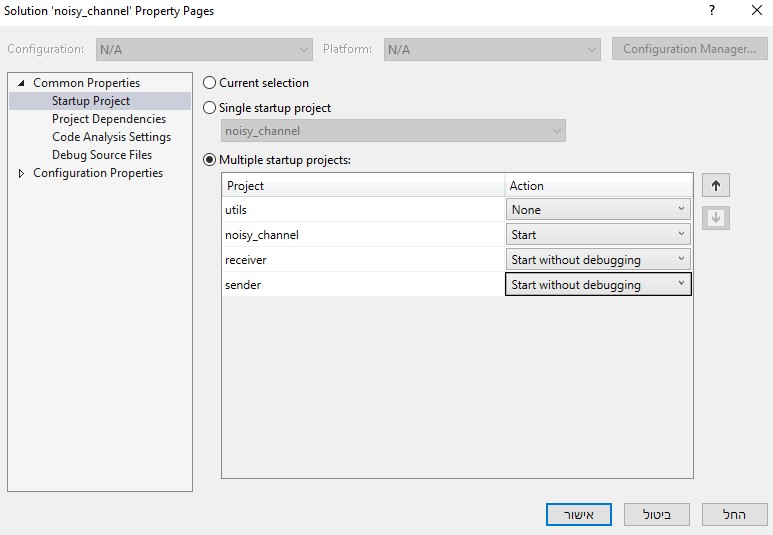

# Intro to Computer Communication EX01  
Iris Taubkin 208410969
Omri Elad 204620702

## General Information  
In order to build the solution correctly we used a 4 vs projects:  
one for each module (Sender, Receiver, Noisy-Channel) and utils functions library.
In this way each solution can be built and debugged independently but code can still be shared.  
The main project (due to our definition) is `noisy_channel` but it can be configured differently.

## Initializion Process on Visual Studio Code  
In order to be able to build the  `solution` properly, make sure to follow this steps:
* add `Ws2_32.lib` to `Linker->Input->Additional Dependencies`  
* add `_CRT_SECURE_NO_WARNINGS;_WINSOCK_DEPRECATED_NO_WARNINGS;_CRT_SECURE_NO_WARNINGS` to `C/C++->Preprocessor->Preprocessor Definitions` to avoid VS C limitations.  
* add `../../utils/utils` to `C/C++->Additional Include Directories` (**no need on utils sub-solution**)  
* Modify utils to be `.lib` (library): `General->Configuration Type->Static Library`  
* Make sure that dependencies are defined for `noisy_channel` solutions & sub-projects:
  * each module has to be set as dependent on utils.
    can be defined by clicking on `project` tab and then `project dependencies`
  * the build order should be set to `utils`->`noisy_channel`->`sender`->`receiver`  
    can be defined by clicking on `project` tab and then `project build order`
* configure running for the solution in order `noisy_channel`->`sender`->`receiver`  
  can be defined by right-clicking on `solution noisy channel` and then `set startup projects`
* ignore unsafe functions: add `4996` to  `Properties > C/C++ > Advanced property->Disable Specific Warnings` to all projects

