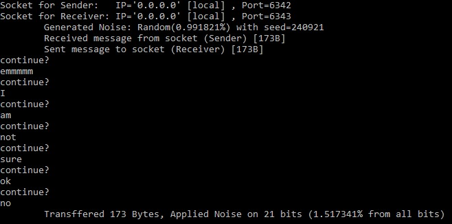

# Intro to Computer Communication EX01  
Iris Taubkin 208410969
Omri Elad 204620702

## General Information  
In order to build the solution correctly we used a 4 vs projects:  
one for each module (Sender, Receiver, Noisy-Channel) and utils functions library.
In this way each solution can be built and debugged independently but code can still be shared.  
The main project (due to our definition) is `noisy_channel` but it can be configured differently.

## Initialization Process on Visual Studio Code  
In order to be able to build the  `solution` properly, make sure to follow this steps:
* add `Ws2_32.lib` to `Linker->Input->Additional Dependencies`  
* add `_CRT_SECURE_NO_WARNINGS;_WINSOCK_DEPRECATED_NO_WARNINGS;` to `C/C++->Preprocessor->Preprocessor Definitions` to avoid VS C limitations.  
* add `../../utils/utils` to `C/C++->Additional Include Directories` (**no need on utils sub-solution**)  
* Modify utils to be `.lib` (library): `General->Configuration Type->Static Library`  
* Make sure that dependencies are defined for `noisy_channel` solutions & sub-projects:
  * each module has to be set as dependent on utils.
    can be defined by clicking on `project` tab and then `project dependencies`
  * the build order should be set to `utils`->`noisy_channel`->`sender`->`receiver`  
    can be defined by clicking on `project` tab and then `project build order`
* configure running for the solution in order `noisy_channel`->`sender`->`receiver`  
  can be defined by right-clicking on `solution noisy channel` and then `set startup projects`
* ignore unsafe functions: add `4996` to  `Properties > C/C++ > Advanced property->Disable Specific Warnings` to all projects


## Overview
* In order to not limit the size files that can be sent through the system we used dynamic-allocated buffers.
  To do so, we are sending two messages each time:
    * the first message is short (limited to 10 Bytes) and is a string representation of the size of the file  
      using this, the destined user (channel and later the receiver) can allocate a buffer
    * the second message is the hamming-encoded file (with/without noise)
* The ports are determined by the channel, which find available ports and assign them to the sockets.  
  There is an option to use default ports (6342, 6343) for easy debugging (minor code modification)


## Utilities Function Module
The utilities library `utils` is composed from the functions needed by all three modules and composed from:
1. Macro Definitions  
   some of the macros define functions
   ```C
    ...
    #define BIT_FLIP_R(character, i) (character ^ (1 << i))   // flip the ith bit from right in character
    #define BIT_SET1_R(character, i) (character | (1 << i))   // Set the ith bit from right in character to 1
    #define BIT_SET0_R(character, i) (character & ~(1 << i))  // Set the ith bit from right in character to 0
    #define BIT_EVAL_R(character, i) ((character >> i) & 1)   // Get the ith bit from right in character
    ...
   ```
   some of the macros define constants 
   ```C
    ...
    #define SENDER -1
    #define RECEIVER -2
    #define DECODED 26
    #define ENCODED 31
    #define PARITY_BITS 5
    #define MAX_LENGTH 1993
    #define SHORT_MESSAGE 10
    #define FAIL -1
    ...
   ```
2. Asserting Functions  
   Written for the code to be cleaner.  
   if the condition is stratified nothing happens,  
   if not the run stops, right after message is printed.
   ```C
   inline void assert(int condition, str message);
   inline void assert_num(int condition, str message, int err_idx);
   ```
   
3. Bit Manipulation Functions
   
4. Winsock2 Wrappers 
   for easy & clean use we wrote the function 
   ```C
    
    //Returns a new Socket & Makes sure it is valid
    SOCKET create_socket();

    //takes a socketaddr* and set it to use Internet Protocol, assign it to port and IP
    void set_address(socketaddr* addr, int port, char* ip);

    // Binds a Socket to a socketaddr & makes sure succeeded
    int bind_socket(SOCKET socket, socketaddr* addr);

    // reading <size> byte from socket into data & makes sure succeeded
    int read_socket(SOCKET socket, str data, int size);

    // write <size> byte from data into socket & makes sure succeeded
    int write_socket(SOCKET socket, str data, int size);
   ```
   

## Channel Description
The channel, which is the server on this project, have a simple functionality:
1. receive message sent by the sender
2. apply noise, according to user (command line) arguments
3. send the noised message to the receiver

When the channel is done with a transaction, it waits for user response for the question `continue?`:  
if the user answer anything besides `yes` or `no` the question will appear again.  


The noise definition is implemented using the Noise struct and applied on the data using a single function:  
  ```C
  typedef struct Noise {
      str type;
      int n;
      int seed;
      double probability;
      int flipped;
      int transmitted;
  } Noise;
  typedef Noise* Noise_p;

  /*
      apply noise on incoming data, according to noise model
  */
  void apply_noise(Noise_p noise, str data, int size, int verbose);
  ```


