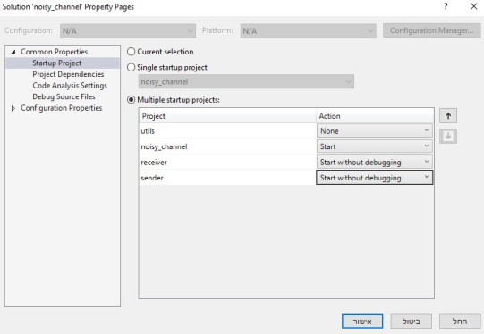
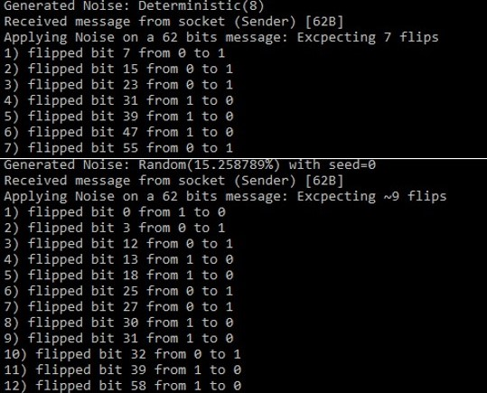
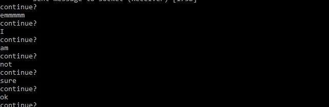

# Intro to Computer Communication<br>First Programming Assignment 
The purpose of the exercise is to acquire a basic knowledge of the programming of socket mechanisms in your work environment.
This assignment will also practice ECC: $Hamming(26,31,3)$.  
The exercise will be presented in pairs:  
**Iris Taubkin** 208410969  
**Omri Elad** 204620702

## General Information  
In order to build the solution correctly we used a 4 Visual-Studio projects:  
one for each module (Sender, Receiver, Noisy-Channel) and utils functions library.
In this way each solution can be built and debugged independently but code can still be shared.  
The main project (due to our definition) is `noisy_channel` but it can be configured differently.

## Initialization Process on Visual Studio  
In order to be able to build the  `solution` properly, make sure to follow this steps:
* add `Ws2_32.lib` to `Linker->Input->Additional Dependencies`  
* add `_CRT_SECURE_NO_WARNINGS;_WINSOCK_DEPRECATED_NO_WARNINGS;` to `C/C++->Preprocessor->Preprocessor Definitions` to avoid VS C limitations.  
* add `../../utils/utils` to `C/C++->Additional Include Directories` (**no need on utils sub-solution**)  
* Modify utils to be `.lib` (library): `General->Configuration Type->Static Library`  
* Make sure that dependencies are defined for `noisy_channel` solutions & sub-projects:
  * each module has to be set as dependent on utils.
    can be defined by clicking on `project` tab and then `project dependencies`
  * the build order should be set to `utils`->`noisy_channel`->`sender`->`receiver`  
    can be defined by clicking on `project` tab and then `project build order`
* configure running for the solution in order `noisy_channel`->`sender`->`receiver`  
  can be defined by right-clicking on `solution noisy channel` and then `set startup projects`
* ignore unsafe functions: add `4996` to  `Properties > C/C++ > Advanced property->Disable Specific Warnings` to all projects




## Overview
* In order to not limit the size files that can be sent through the system we used dynamic-allocated **buffers**.
  To do so, we are sending two messages each time:
    * the first message is short (limited to 10 Bytes) and is a string representation of the size of the file  
      using this, the destined user (channel and later the receiver) can allocate a buffer
    * the second message is the hamming-encoded file (with/without noise)
* The ports are determined by the channel, which find available ports and assign them to the sockets.  

**ADDITIONAL FEATURE**:  
In order to ise pre-defined ports by the channel (easier to debug) one can `--debug` argument  
Using the additional argument will set the ports (that the channel is listening to) to the following:  
6342 for the sender and 6343 for the receiver, allowing running all of executables in single click (after Initializing in VS)
When working on debug mode that channel will be in `verbose` mode as well, printing the applied noise:  



## Bit Manipulation:
In Order to simplify all the bit manipulation needed for implementing the Hamming Code we decided on the following approach:  
Given a file with n bits ( a multiple of 26 ) it will be parsed to a string s with n characters that satisfies: .  
note that since n is a multiple of 26 we get that  .  
s will be encoded by Hamming algorithm to

and will be sent through the channel to the receiver.  
In the receiver s' will be decoded back to s (if possible) and the original file will be re-written.  


## Assumptions
1. Files:  
   We assumed that the input file passed to the exists in the system.
   In case it doesn't exists, the program exiting (returns 0), and presenting an error.

2. Buffer Lengths:  
   While the buffer used to write & read data is allocated dynamically (according to message size) other buffers are limited.
   File names are limited by a parameter `MAX_LENGTH` set by default to 1993 Bytes.
   Buffers for the initial message (of data size) is limited by a parameter `SHORT_MESSAGE` se by default to 10 Bytes.
   parameter `ENCODED` and `DECODED` are limiting buffer according to hamming requirements.

3. Noise:  
We assumed a bit can be flipped only once in the channel. Allowing bits to be flipped more then once is adding complexity to the calculation, in addition to making the problem less complicated, since a bit can be either flipped or not.  
An even number of flips (per bit) is qual to zero, just as odd number of flips (per bit) is equal to a single flip.

## Hamming Error-Correction-Code  
We used $Hamming(26,31,3)$ in the assignment:
meaning a block of 26 bits is encoded into 31 bits: for every 26 bits in the original data, 31 bits are being sent.  
This is allowing us to detect up to 2 corrupted bits per block and fix a single error.  
when using **Deterministic noise** with $n < 31$ the file will not be fixable (flips more then 1 bit in block)


## Utilities Function Module
The utilities library `utils` is composed from the functions needed by all three modules and composed from:
1. Macro Definitions  
   some of the macros define functions
  ```C
  ...
  #define BITS_PER_BYTE 8
  #define BYTE_FLIP(char_to_flip) ((char_to_flip == '0') ? '1' : '0')
  #define BIT_FLIP_R(character, i) (character ^ (1 << i))   // flip the ith bit from right in character
  #define BIT_SET1_R(character, i) (character | (1 << i))   // Set the ith bit from right in character to 1
  #define BIT_SET0_R(character, i) (character & ~(1 << i))  // Set the ith bit from right in character to 0
  #define BIT_EVAL_R(character, i) ((character >> i) & 1)   // Get the ith bit from right in character
  ...
  ```
   some of the macros define constants 
  ```C
  ...
  #define SENDER -1
  #define RECEIVER -2
  #define DECODED 26
  #define ENCODED 31
  #define PARITY_BITS 5
  #define MAX_LENGTH 1993
  #define SHORT_MESSAGE 10
  #define FAIL -1
  ...
  ```
2. Asserting Functions  
   Written for the code to be cleaner.  
   if the condition is stratified nothing happens,  
   if not the run stops, right after message is printed.
  ```C
  inline void assert(int condition, str message);
  inline void assert_num(int condition, str message, int err_idx);
  ```
   
3. Bit Manipulation Functions
   since the simple bit manipulation (flip, set0, set1, get) is defined ias macros
   the bit-manipulation **functions** are mostly covering the hamming complex manipulation.
   
4. Winsock2 Wrappers 
   for easy & clean use we wrote the function 
  ```C
  
  //Returns a new Socket & Makes sure it is valid
  SOCKET create_socket();

  //takes a socketaddr* and set it to use Internet Protocol, assign it to port and IP
  void set_address(socketaddr* addr, int port, char* ip);

  // Binds a Socket to a socketaddr & makes sure succeeded
  int bind_socket(SOCKET socket, socketaddr* addr);

  // reading <size> byte from socket into data & makes sure succeeded
  int read_socket(SOCKET socket, str data, int size);

  // write <size> byte from data into socket & makes sure succeeded
  int write_socket(SOCKET socket, str data, int size);
  ```
   

## Channel Description
The channel, which is the server on this project, have a simple functionality:
1. receive message sent by the sender
2. apply noise, according to user (command line) arguments
3. send the noised message to the receiver


The noise definition is implemented using the Noise struct and applied on the data using a single function:  
  ```C
  typedef struct Noise {
      str type;
      int n;
      int seed;
      double probability;
      int flipped;
      int transmitted;
  } Noise;
  typedef Noise* Noise_p;

  /*
      apply noise on incoming data, according to noise model
  */
  void apply_noise(Noise_p noise, str data, int size, int verbose);
  ```

When the channel is done with a transaction, it waits for user response for the question `continue?`.  
if the user answer anything besides `yes` or `no` the question will appear again, as demonstrated here:  

